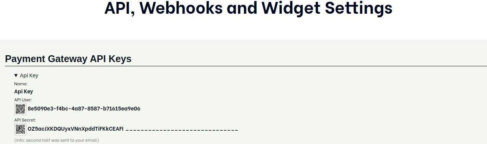

# Payment Gateway Webhost PHP Client

PHP Client for interacting with Payment Gateway Webhost API

# Requirements

- PHP >= 8.0 with `ext-curl` and `ext-json`

The client does not restrict you to a specific PHP version. It is tested on PHP 8.1 and 8.5, and works on any version up to 8.5. We recommend using the latest PHP 8.5 release.

# Install

Run `composer require forumpay/payment-gateway-php-client`

# Usage

Example usage for getting currency list.

```php
use ForumPay\PaymentGateway\PHPClient\PaymentGatewayApi;

$paymentGatewayApi = new PaymentGatewayApi(
    $paymentGatewayUri,
    $apiUser,
    $apiSecret,
    $userAgentApplicationIdentifier
);

try {
    $getCurrencyListResponse = $paymentGatewayApi->getCurrencyList('EUR');
} catch (ApiExceptionInterface $exception) {
    //TODO: handle the exception
}
```
**Where:**

`$paymentGatewayUri` is *Service URL* as per API documentation

`$apiUser` and `$apiSecret` are credentials for *Payment Gateway API Keys*

`$userAgentApplicationIdentifier` represents the user agent application identifier for HTTP the client. Example: (*'MyPaymentApp/1.0.0'*)



# Available endpoints

- Ping
- Me
- GetRate
- GetRates
- StartPayment
- CheckPayment
- GetTransactions
- CancelPayment
- GetCurrencyList
- RequestKyc
- GetWalletApps

For corresponding methods refer to `PaymentGatewayApiInterface` in `src/PaymentGatewayApiInterface.php`
